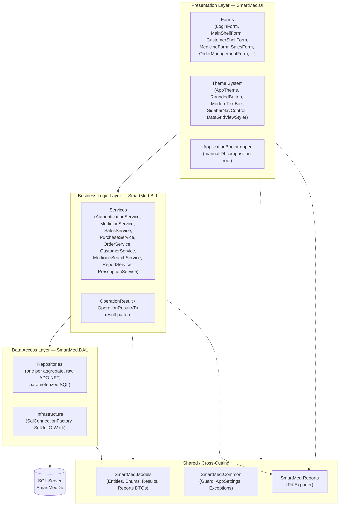
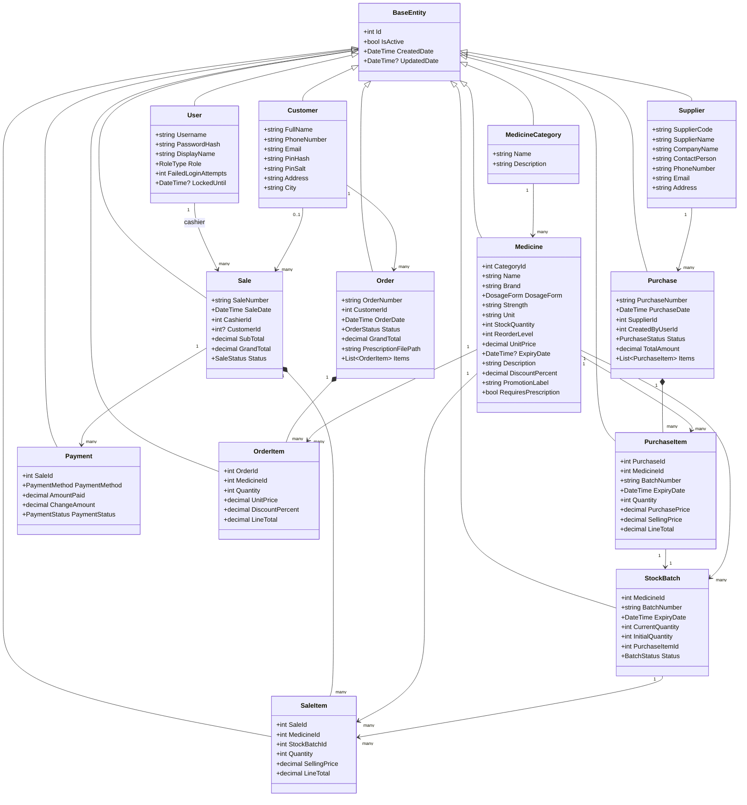
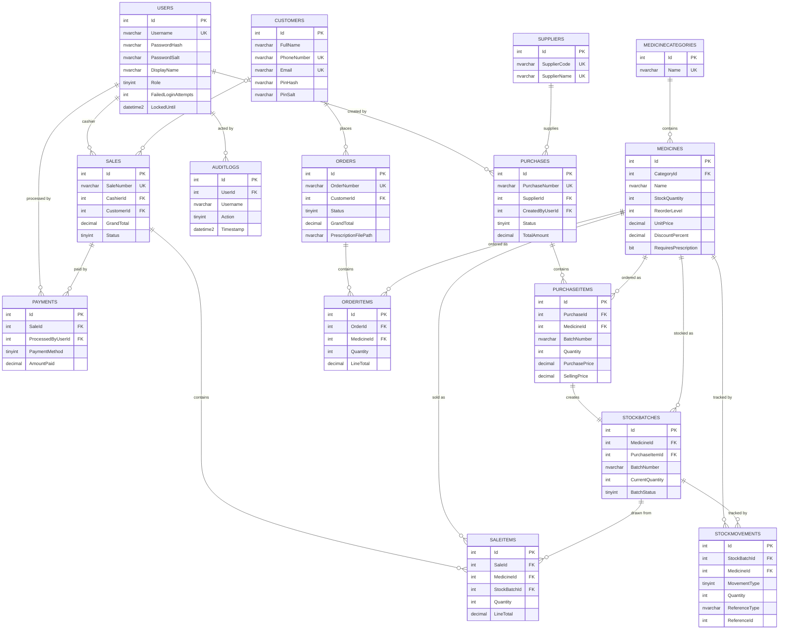
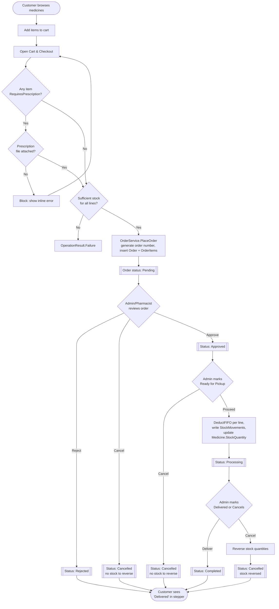
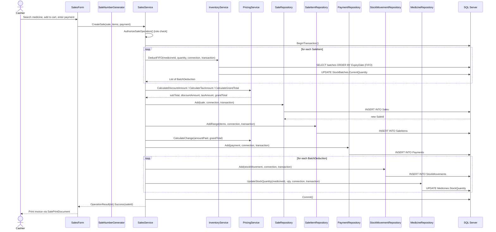

# SmartMed Pharmacy Management System — UML & Architecture Diagrams

All diagrams below are Mermaid code and are drawn directly from the actual implementation (real class names, real table/column/foreign-key names, real method call chains) rather than a generic template. Paste any block into the [Mermaid Live Editor](https://mermaid.live), a GitHub Markdown preview, or your report tool to render it.

---

## 1. Use Case Diagram

Mermaid has no native UML use-case notation, so actors and use cases are modeled as a `flowchart` with actor nodes on the left and rounded "use case" nodes grouped by module. The four actors and their visible capabilities are taken directly from the role-gating logic in `MainShellForm.UpdateMenuVisibility()` and `CustomerShellForm`'s sidebar (Session 2).

```mermaid
flowchart LR
    Admin(["👤 Administrator"])
    Pharmacist(["👤 Pharmacist"])
    Cashier(["👤 Cashier"])
    Customer(["👤 Customer"])

    subgraph Catalogue["Catalogue Management"]
        UC1(("Manage Medicines"))
        UC2(("Manage Categories"))
    end

    subgraph Procurement["Procurement"]
        UC3(("Manage Suppliers"))
        UC4(("Create/Confirm Purchases"))
    end

    subgraph POS["Point of Sale"]
        UC5(("Process Sale"))
    end

    subgraph OrdersMod["Customer Orders"]
        UC6(("Manage Orders / Advance Status"))
        UC7(("View Prescription"))
        UC8(("Register Account"))
        UC9(("Browse Medicines"))
        UC10(("Manage Cart"))
        UC11(("Place Order"))
        UC12(("Track My Orders"))
        UC13(("Cancel My Order"))
    end

    subgraph PeopleMod["People"]
        UC14(("Manage Customers"))
    end

    subgraph Insights["Insights"]
        UC15(("Generate Reports"))
        UC16(("Export CSV/Excel/PDF"))
        UC17(("View Dashboard"))
    end

    subgraph AuthMod["Authentication"]
        UC18(("Staff Login"))
        UC19(("Customer Lookup Login"))
    end

    Admin --> UC1 & UC2 & UC3 & UC4 & UC5 & UC6 & UC7 & UC14 & UC15 & UC16 & UC17 & UC18
    Pharmacist --> UC1 & UC2 & UC6 & UC7 & UC18
    Cashier --> UC5 & UC18
    Customer --> UC8 & UC9 & UC10 & UC11 & UC12 & UC13 & UC19
```

---

## 2. Three-Layer Architecture Diagram

Reflects the real project reference graph: `SmartMed.UI` depends on `SmartMed.BLL`, `SmartMed.Reports`, `SmartMed.Models`, and `SmartMed.Common`; `SmartMed.BLL` depends on `SmartMed.DAL`, `SmartMed.Reports`, `SmartMed.Models`, and `SmartMed.Common`; `SmartMed.DAL` depends only on `SmartMed.Models` and `SmartMed.Common`, and talks to SQL Server via `System.Data.SqlClient`.

---

## 3. Component Diagram

Shows the concrete components inside each layer and their dependency arrows, matching how `ApplicationBootstrapper.RegisterServices()` actually wires everything together.

```mermaid
flowchart TB
    subgraph UI["SmartMed.UI"]
        LoginForm
        MainShellForm
        CustomerShellForm
        MedicineForm
        SalesForm
        OrderManagementForm
        CustomerManagementForm
        BrowseMedicinesForm
        CartAndCheckoutForm
        DashboardForm
    end

    subgraph BLL["SmartMed.BLL Services"]
        AuthenticationService
        SessionManager
        MedicineService
        MedicineCategoryService
        SupplierService
        PurchaseService
        InventoryService
        SalesService
        PricingService
        SaleNumberGenerator
        OrderService
        OrderNumberGenerator
        CustomerService
        PrescriptionService
        MedicineSearchService
        ReportService
    end

    subgraph DAL["SmartMed.DAL Repositories"]
        UserRepository
        CustomerRepository
        MedicineRepository
        MedicineCategoryRepository
        SupplierRepository
        PurchaseRepository
        PurchaseItemRepository
        StockBatchRepository
        StockMovementRepository
        SaleRepository
        SaleItemRepository
        PaymentRepository
        OrderRepository
        OrderItemRepository
        ReportRepository
        AuditLogRepository
    end

    DB[("SQL Server")]

    LoginForm --> AuthenticationService
    MainShellForm --> SalesService & PurchaseService & MedicineService & SupplierService & OrderService & CustomerService & ReportService
    CustomerShellForm --> MedicineSearchService & OrderService & PrescriptionService & CustomerService
    MedicineForm --> MedicineService & MedicineCategoryService
    SalesForm --> SalesService & InventoryService & PricingService & SaleNumberGenerator
    OrderManagementForm --> OrderService & CustomerService
    CustomerManagementForm --> CustomerService & OrderService
    BrowseMedicinesForm --> MedicineSearchService
    CartAndCheckoutForm --> OrderService & PrescriptionService
    DashboardForm --> ReportService

    AuthenticationService --> UserRepository & CustomerRepository & AuditLogRepository & SessionManager
    MedicineService --> MedicineRepository
    PurchaseService --> PurchaseRepository & PurchaseItemRepository & StockBatchRepository & StockMovementRepository
    SalesService --> SaleRepository & SaleItemRepository & PaymentRepository & InventoryService
    InventoryService --> StockBatchRepository & StockMovementRepository
    OrderService --> OrderRepository & OrderItemRepository & InventoryService
    CustomerService --> CustomerRepository
    ReportService --> ReportRepository
    MedicineSearchService --> MedicineRepository

    UserRepository & CustomerRepository & MedicineRepository & SupplierRepository & PurchaseRepository & StockBatchRepository & SaleRepository & OrderRepository & ReportRepository --> DB
```

---

## 4. Class Diagram

Core domain entities from `SmartMed.Models/Entities/*.cs`, all inheriting `BaseEntity` (`Id`, `IsActive`, `CreatedDate`, `UpdatedDate`) except the logging POCOs.

---

## 5. ER Diagram

Reflects the real SQL tables/foreign keys from `SmartMed.DAL/Scripts/*.sql`, including the `Sales.CustomerId` fix and the `Orders`/`OrderItems`/`Customers` tables added this session.

---

## 6. Activity Diagram

The end-to-end customer order fulfillment workflow, mirroring the real branching logic in `OrderService.PlaceOrder` and `OrderService.UpdateOrderStatus`/`ValidateTransition` (Session 1/2).

---

## 7. Sequence Diagram

The point-of-sale flow, matching the real call sequence inside `SalesService.CreateSale` (transaction, FIFO deduction, sale number generation, stock movement logging).

